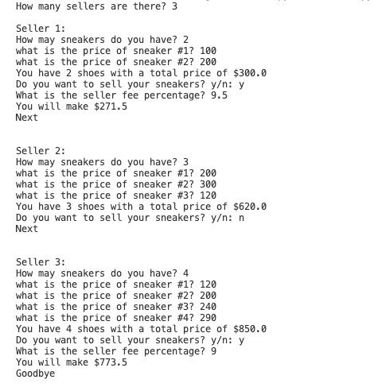

# helloWorld
## Overview
This program allows multiple sellers to input their amount of shoes and price of each shoe, and gives the options of selling the shoes with the input of a seller fee. 
## Development Environment
* VS Code
* Python 3.8.5

## Execution
To run put: 
```python
python3 seller.py
``` 
Information should then be entered into the program.
The ouput is like this:    


## Useful Websites

*[Here](https://stackoverflow.com) is Stack Overflow that helped me with this project.